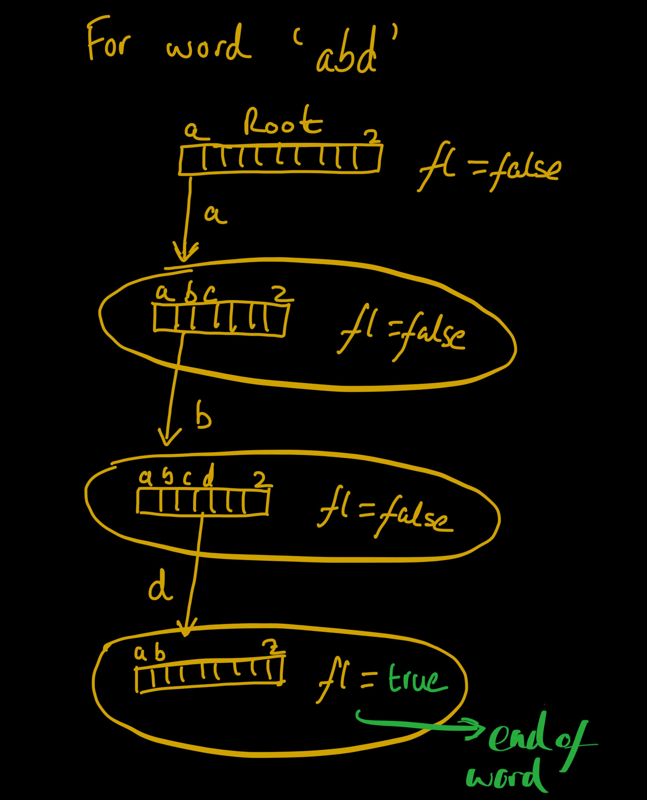

# Explanation of Trie Implementation for Longest Common Prefix

---

## What is a Trie?

A **Trie** (also known as a prefix tree) is a tree-like data structure that stores strings in a way that allows for efficient searching of common prefixes. It’s especially useful when dealing with large sets of strings that share common prefixes.
Below is a detailed explanation along with a diagram.

### Key Features of a Trie:
- Each node in a Trie represents a character, where it has pointers to other nodes, count of the pointers, and a flag.
- The root node represents an empty string or a starting point.
- Each edge of the trie represents a character.
- Each path down the tree represents a possible prefix of the strings stored in the Trie.
- A **leaf node** marks the end of a word.
- It supports efficient prefix-based queries, which makes it ideal for tasks like finding the longest common prefix.

---

## `Node` Class

```java
static class Node {
    Node chars[] = new Node[26]; // pointers to other nodes 'a' to 'z'
    boolean isEnd = false;       // true if this node marks end of a word
    int count = 0;               // number of non-null children

    public boolean contains(char ch) {
        return chars[ch - 'a'] != null;
    }
}
```

- `chars[]`: This array stores 26 children, one for each lowercase letter ('a' to 'z'). Each child represents a possible next character in a word.
- `isEnd`: A boolean flag indicating whether this node is the end of a complete word. If true, the node marks the end of a word.
- `count`: This variable counts the number of non-null children, which helps to track the uniqueness of a prefix path.

Using the diagram below we will implement the Trie class, insert function, and find longest common prefix function</br>
### Here each circle represents a node along with the Root node at the top


## `Trie` Class
```java
static class Trie {
    Node root;
    
    Trie() {
        root = new Node(); // Initialize the root node
    }

    public void insert(String key) {
        Node temp = root;
        for (char ch : key.toCharArray()) {
            if (!temp.contains(ch)) {
                temp.chars[ch - 'a'] = new Node(); // Create a new node if not present
                temp.count++; // Increment count for each new node
            }
            temp = temp.chars[ch - 'a']; // Move to the next node
        }
        temp.isEnd = true; // Mark the end of the word
    }

    public String find() {
        StringBuilder prefix = new StringBuilder();
        Node temp = root;
        
        // Traverse the Trie until a node with multiple children or the end of the word is reached
        while (temp.count == 1 && !temp.isEnd && temp != null) {
            int idx = -1;
            for (int i = 0; i < 26; i++) {
                if (temp.chars[i] != null) {
                    prefix.append((char)(i + 'a')); // Append the character to the prefix
                    idx = i;
                    break;
                }
            }
            temp = temp.chars[idx]; // Move to the next node
        }
        return prefix.toString(); // Return the longest common prefix
    }
}
```

## `Solution` Class Implementation
```java
public String longestCommonPrefix(String[] strs) {
    Trie trie = new Trie();
    for (String key : strs) {
        trie.insert(key); // Insert each word into the Trie
    }
    return trie.find(); // Find and return the longest common prefix
}
```


